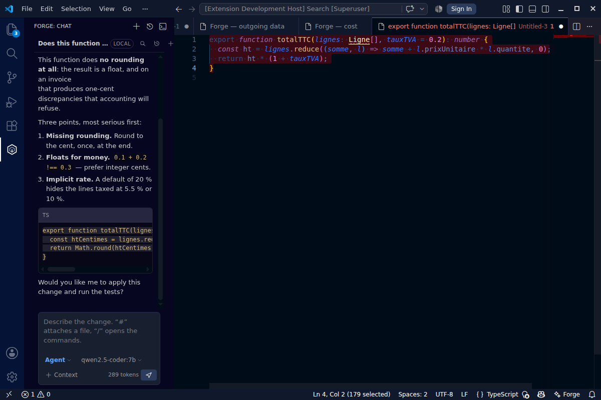
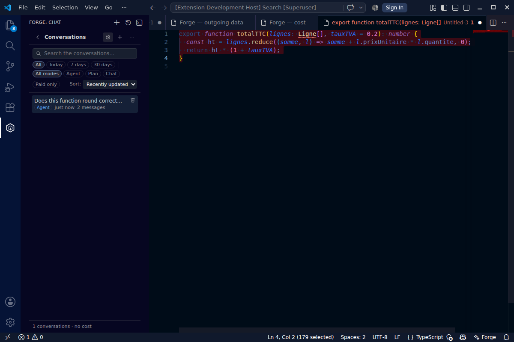
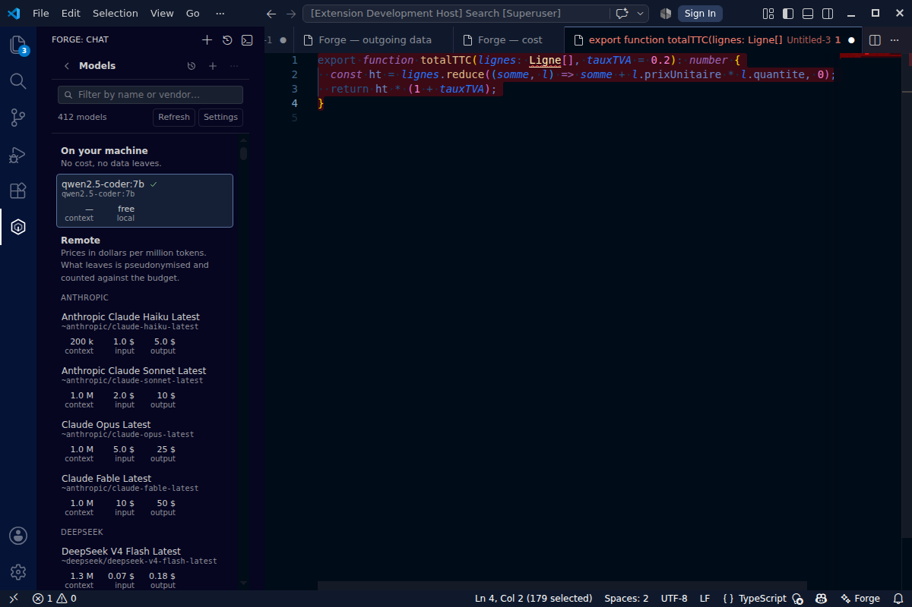

# Forge

**A coding assistant for VS Code that does not send your code away.**
Local models (Ollama, LM Studio, vLLM, llama.cpp) or a remote gateway (OpenRouter, Azure, LiteLLM,
Anthropic) — your choice, per role, and **pseudonymised when it does leave**.

Open source (Apache-2.0), **zero runtime dependencies**, **zero telemetry**.

[Français](README.fr.md) · [Architecture](docs/ARCHITECTURE.md) · [Privacy](docs/PRIVACY.md) ·
[Threat model](docs/THREAT-MODEL.md)



*Real screenshots, taken from a VS Code launched by the integration suite. Only the model answering
is a stub server; the interface is the product.*

| Conversations | Models |
|---|---|
|  |  |

---

## Why

GitHub Copilot is excellent, and it presents a company with two problems:

1. **The code leaves.** Every keystroke, every open file, every question goes to a third party. For
   a lot of teams — health, defence, banking, subcontractors under NDA — that alone closes the file.
2. **The cost is structural.** The product sends everything to one large remote model, because that
   is the product. You pay per developer, every month, for completions that are 90 % trivial.

Forge inverts both: **the default is the model already running on your machine**, the remote one is
an **escalation** that has to be justified, consented to, and paid for out of a budget; and anything
that does leave is **reversibly pseudonymised** first.

## What it does

| | |
|---|---|
| **Inline completion** | Fill-in-the-middle with your local code model. Debounced, cancellable, with a typed-through cache that serves the rest of a suggestion **with no request at all**. |
| **Sidebar chat** | Streaming, attachments (active file, selection, chosen files), per-workspace history, model picker, context and cost meters. |
| **Three modes** | **Chat** (no tools), **Plan** (reads the repository, changes nothing), **Agent** (reads, edits, proposes commands). The mode decides the tool set **in code**: in plan mode no writing tool exists — it is not an instruction in a prompt. |
| **Agent mode** | Reads the repository, searches it, consults the **editor's diagnostics**, edits files and proposes commands — **one approval per action**, a diff before every write, everything in the undo stack. |
| **Permissions** | Per action and per shape of action: “allow once”, “for this conversation”, “always”. Allowing `npm test` does not allow `npm publish`. A dedicated screen separates what is permanent from what expires. |
| **Reasoning** | An adjustable thinking budget (direct / brief / standard / deep), translated per provider — `reasoning.effort` on OpenRouter, a token budget on Anthropic. The thinking is shown in a collapsed block and never sent back to the model. |
| **Terminal** | The `forge` command: the same core in a REPL, with command output actually captured and a diff printed before every write. |
| **In the editor** | `Ctrl+I` rewrites the selection in place · right-click → ask about the selection · commit message written from the staged diff · “explain the terminal output”. |
| **Quick fixes** | On an error reported by your language server: “Fix with Forge” and “Explain this problem”. The compiler says **what** and **where**; the model only has to fix it — which is what makes a small local model enough for most everyday cases. |
| **Search** | Inside the open conversation (`Ctrl+F`, matches highlighted) **and** across the whole history — the search looks inside the messages and shows the fragment that matched. |
| **History filters** | Period, mode, “paid only”, and four sort orders (recently updated, created, longest, most expensive). |
| **Context control** | Every exchange can be **muted** (stays on screen, stops being sent), **pinned** (survives trimming), edited or deleted. It is the most direct lever there is on both quality **and** cost. |
| **Privacy** | Reversible pseudonymisation, blocked files, consent before the first destination, an **egress log** and a **cost report**. |
| **Languages** | English and French, following the editor's display language — or pinned with `forge.language`, for a machine whose editor is in one language and whose user reads another. |

## How the cost tends to zero

Not a slogan — an architecture. Five levers, in order of effect:

1. **Completion never escalates.** It is the high-frequency traffic — one request per pause in
   typing. It runs on a local code model (7B is enough) and costs electricity. The router forbids
   escalating it *whatever* the configured policy.
2. **Send a map, not the territory.** The ambient context is a **repository map** (paths + top-level
   symbols, extracted without a native parser), not file contents. A few thousand tokens describe a
   repository a hundred times their size, and the model asks for the two files it needs instead of
   being handed forty.
3. **The prompt cache.** The stable prefix (system prompt + repository map) is marked with
   `cache_control` on Anthropic and benefits from implicit caching elsewhere. A coding conversation
   resends almost the same context every turn: that is where most of the bill is decided.
4. **Do not ask when it is pointless.** No request mid-word, none in front of existing code, none
   for a context the model already had nothing to say about; and the rest of a suggestion you are
   typing through is served from the cache.
5. **A budget that refuses.** A per-request cap (one runaway prompt cannot cost a dinner) and a
   daily cap, checked **before** the call on an estimate, recorded **after** on the real cost when
   the provider reports it (OpenRouter does).

Default result: **$0**. The first cent spent is an explicit choice.

## How privacy is kept

Four steps, in this order, on everything bound for a remote provider:

1. **Blocked.** A file matching `privacy.blockedGlobs` (`.env`, keys, `secrets/**`…) is never
   attached, neither in chat nor in completion.
2. **Reversible pseudonymisation.** Credentials (known shapes + an entropy safety net), e-mail
   addresses, phone numbers, IP addresses, internal hosts, account names in paths, and the
   **organisation-specific terms** you list. `alice@corp.fr` becomes `⟨EMAIL_1⟩` — **always the same
   marker**, so the model can still reason — and becomes `alice@corp.fr` again on your machine,
   including in the code it sends back.
3. **Refused.** A detected credential raises a modal warning; it has already been replaced anyway.
   The “off” level never applies to credentials: privacy is a preference, a password is not.
4. **Consent.** Before the first request to a given destination: what leaves (volume, destination,
   model) and what was masked.

Then, **the proof**: `Forge: Show outgoing data` lists every remote request — timestamp, host,
model, tokens, share served from cache, cost, redaction categories. **Never the content**: a log of
what you were trying to keep private is not a privacy feature.

The places where others get this wrong, and which are handled here:

- **The endpoint decides, not the setting name.** Pointing the “local” provider at a public URL
  triggers pseudonymisation and consent like any other.
- **Every agent step goes through the gate again.** A file the agent just read is new text: it is
  pseudonymised again before the next call.
- **Attached content is fenced.** Files, logs and pages arrive inside a block closed by a
  **per-turn nonce**; an injection hidden in a file cannot close a block whose delimiter it cannot
  guess.
- **Keys live in the OS keychain** (`SecretStorage`), never in `settings.json` — which syncs, and
  gets committed by accident.

## Install

From the VS Code Marketplace: search for **Forge** (publisher `hivey`).

From source:

```bash
git clone https://github.com/FlorianMartins/forge
cd forge
npm ci
npm run build
npx @vscode/vsce package --no-dependencies   # produces forge.vsix
code --install-extension forge.vsix
```

For the model, the simplest setup:

```bash
ollama pull qwen2.5-coder:7b   # completion + chat, ~5 GB
ollama serve
```

Nothing else to configure: the defaults point at `http://127.0.0.1:11434/v1`.

To add a remote escalation: `Forge: Store a provider key`, then set `forge.escalation.model` (for
example `anthropic/claude-sonnet-4.5`).

### The terminal client

```bash
npm link            # puts `forge` on the PATH
forge               # REPL in the current directory
forge "why is this test flaky?"   # one-shot question
```

Configuration comes from `.forge.json` (working directory, then `~`), so a project can commit its
team configuration without committing a key (`apiKeyEnv` names the environment variable).

REPL commands: `/context` lists the exchanges, `/mute 3` takes one out of the context without
deleting it, `/forget 3` deletes it, `/mode` switches between chat, plan and agent, `/cost` shows
the day's spend. From the editor, `Forge: Open Forge in the terminal` starts it with the same
configuration as the sidebar.

## Enterprise deployment

- Serve one model for everyone: **vLLM** or **Ollama** behind an internal URL, and push
  `forge.endpoints.local` through VS Code's settings policy.
- Lock down what needs it: `privacy.blockedGlobs`, `privacy.customTerms` (client and project
  names), `privacy.egressPolicy: "ask-always"`, `budget.dailyUsd`.
- `forge.*` settings are workspace-scoped: a sensitive repository can force `chat.provider: "local"`
  in its own `.vscode/settings.json`.
- The extension ships **no runtime dependency**: what you audit is the bundle and nothing else. An
  SBOM is published on every CI run.

## Architecture

```
src/core/         no `vscode` import — testable without an editor
  redaction/      detectors, pseudonym vault, policy
  providers/      OpenAI-compatible (Ollama, vLLM, LiteLLM, OpenRouter…) + native Anthropic
  router/         local first, consented escalation, prices, budget
  completion/     FIM per model family, cache, answer cleanup
  context/        repository map, symbols, imports
  session/        the transcript, the prompt derived from it, the modes and the history
  agent/          the tool loop, and the permission book
src/shared/       the panel↔extension protocol, and the translation catalogue
src/extension/    the VS Code layer (sidebar, completion, commands, egress gate)
src/cli/          the terminal client
src/webview/      the panel: chat / history / models / permissions screens, hand-drawn SVG icons,
                  and never `innerHTML` on model output
```

More: [`docs/ARCHITECTURE.md`](docs/ARCHITECTURE.md) · [`docs/PRIVACY.md`](docs/PRIVACY.md) ·
[`docs/THREAT-MODEL.md`](docs/THREAT-MODEL.md) · decisions: [`docs/adr/`](docs/adr).
Those documents are currently written in French; translations are welcome.

## Development

```bash
npm test                   # builds the bundles, then 128 tests (node:test)
npm run test:integration   # loads the extension into a real VS Code (7 tests, headless)
npm run typecheck
npm run scan:secrets       # scans this repository with the extension's own detectors
npm run models             # regenerates the price catalogue from OpenRouter
npm audit --audit-level=high   # 0 vulnerabilities: 5 dev tools, no runtime dependency
```

CI runs types, tests, integration tests in a real VS Code, the secret self-scan, `npm audit`,
CodeQL, the `.vsix` packaging and an SBOM. The price catalogue is regenerated daily by a scheduled
job: **no version and no price is ever written by hand**.

### Translating

The interface is English in the source and translated through one table:
[`src/shared/i18n.fr.ts`](src/shared/i18n.fr.ts) for the panel, the extension and the CLI, and
`package.nls.<lang>.json` for the manifest. To add a language, copy those two files, translate the
values, and register the table in `src/shared/i18n.ts`. A test fails if a string in the source has
no entry, so a translation cannot silently rot.

## Status

`0.3.0` — usable day to day. See [`docs/ROADMAP.md`](docs/ROADMAP.md) for what is done and what is
not.

## Licence

Apache-2.0.
